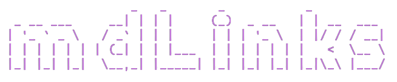
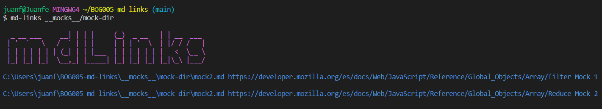
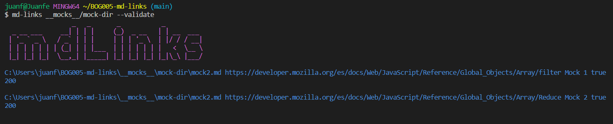
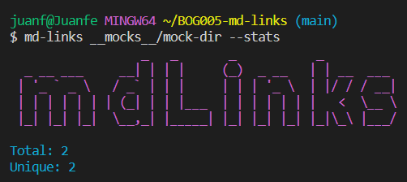
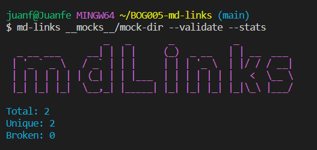

# MD-Links

## Índice

* [1. Resumen del proyecto](#1-Resumen-del-proyecto)
* [2. Diagrama de flujo](#2-Diagrama-de-flujo)
* [3. Instalacion y guia de uso de la libreria](#3-Instalacion-y-guia-de-uso-de-la-libreria)
* [4. Autora](#4-Autora)

***

## 1. Resumen del proyecto
Librería que permite extraer y validar links de archivos markdown (.md), obteniendo las siguientes estadísticas : 

- Links totales.
- Links únicos.
- Links rotos.

## 2. Diagrama de flujo

## 3. Instalación y guia de uso de la libreria

### **Instalación**: 
---
~~~
npm i @estefania.camargo.263/md-links
~~~

### **Guia de uso**: 
---

- Al ejecutar el comando md-links sin una ruta, mostraria sus opciones, ademas un mensaje que le indica al usuario que debe introducir un archivo o directorio. 

Ejemplo : 
 
 

---

- En la terminal ingresamos el comando md-Links seguido de la ruta absoluta o relativa de la ubicación del archivo y/o carpeta en la cual se buscaran los links.

Modo de uso : 
~~~
md-links some/example-dir
~~~
Ejemplo : 

---

- Ingresando el comando md-Links seguido de la ruta y seguido del comando --validate, obtendremos las propiedades de los links encontrados. 

Modo de uso : 
~~~
md-links some/example-dir --validate
~~~

Ejemplo : 

---

- Ingresando el comando md-Links seguido de la ruta y seguido del comando --stats, obtendremos las estadisticas de los links encontrados(total de links y cantidad de links unicos).

Modo de uso : 
~~~
md-links some/example-dir --stats
~~~

Ejemplo : 

---

- Ingresando el comando md-Links seguido de la ruta y seguido de los comandos --stats --validate o --validate --stats, obtendremos la cantidad total de links que encontremos en ese archivo, el total de links unicos encontrados y el total de links rotos.

Modo de uso : 
~~~
md-links some/example-dir --validate --stats
~~~

Ejemplo : 

---

## 4. Autora : 

Estefania Camargo Ramirez. 